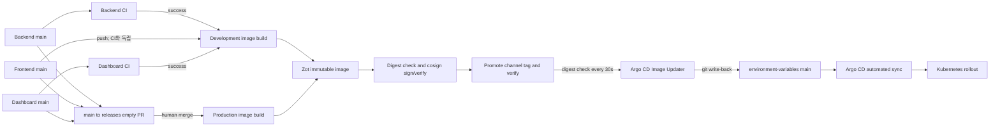

# BottleNote 배포 운영 가이드

마지막 원격 코드·Actions 확인: 2026.09.05 KST

이 문서는 BottleNote 애플리케이션의 현재 배포 계약을 사람과 AI 운영자가 같은 방식으로 해석하도록 만든 실행 기준이다. 표준 경로는 `애플리케이션 저장소 → Zot Registry → Argo CD Image Updater → environment-variables → Argo CD → Kubernetes`이며, GitHub Actions 성공만으로 배포 완료를 선언하지 않는다.

현재 설명은 13절의 고정 SHA를 기준으로 한다. 12절의 2026.08.29 Registry·클러스터 실증은 당시 기록이며, 현재 workflow나 runtime이 같다는 근거로 사용하지 않는다. 이번 감사에서는 Registry·클러스터·HTTP 상태를 새로 확인하지 않았다.

## 1. 핵심 원칙

1. 개발 배포는 애플리케이션 저장소별 `main` 변경을 기준으로 시작한다. Backend와 Admin Dashboard는 선행 CI 성공이 gate이고, Frontend는 현재 `main` push와 동시에 직접 시작한다.
2. 표준 운영 릴리즈는 각 저장소의 `release PR create`로 만든 빈 Release PR을 merge할 때 시작한다. Admin Dashboard의 핫픽스만 별도 `hotfixes/**` PR 경로를 사용한다.
3. Release PR에는 별도 승인 리뷰가 필요하지 않다. 따라서 **merge 권한을 가진 사람이 merge하는 행위 자체가 운영 배포 승인**이다.
4. 이미지는 감사용 immutable 태그로 먼저 발행하고 digest 확인·서명·서명 검증을 통과한 뒤 환경별 mutable `latest`로 승격한다. 실제 배포 상태는 그 digest로 고정한다.
5. Argo CD Image Updater는 30초마다 digest를 확인하고 `environment-variables`의 Kustomization에 Git write-back한다. Argo CD가 그 커밋을 동기화해야 Kubernetes rollout이 시작된다.
6. 완료 판정은 Actions, Registry, GitOps 커밋, Argo 상태, Deployment 이미지, Pod readiness, HTTP health를 모두 확인한 뒤 내린다.
7. 애플리케이션 배포를 위해 로컬에서 이미지를 push하거나 Kubernetes 매니페스트를 직접 apply하지 않는다.
8. `releases/**`, `hotfixes/**`를 수동으로 만들지 않는다. 각 저장소의 Release PR 생성 workflow를 사용한다. 브랜치에 남은 과거 workflow 사본이 실행 경로를 바꿀 수 있다.

## 2. 저장소와 책임 경계

| 저장소 또는 시스템 | 현재 책임 | 주요 근거 |
|---|---|---|
| `bottle-note-api-server` | Product/Admin CI, 개발 이미지 발행, 운영 Release PR 생성·검증, Backend 이미지 발행·서명 | `.github/workflows/ci_pipeline.yml`, `deploy_development_applications.yml`, `release_pr_pilot_create.yml`, `release_pr_pilot_merged.yml`, `deploy_release_applications.yml` |
| `bottle-note-frontend` | Frontend build/test CI, `main` push 개발 배포, 운영 Release PR 생성·검증, Frontend 이미지 발행·서명 | `.github/workflows/build_validation.yml`, `test_validation.yml`, `deploy_development.yml`, `release_pr_create.yml`, `release_pr_merged.yml`, `deploy_release_applications.yml` |
| `admin-dashboard` | Dashboard CI, 개발 배포, 표준·핫픽스 Release PR 검증, 이미지 발행·서명·승격 | `.github/workflows/ci.yml`, `deploy-dev.yml`, `release_pr_create.yml`, `release_pr_merged.yml`, `hotfix_pr_merged.yml`, `deploy_release_applications.yml` |
| `bottle-note-app` | Android 빌드와 Google Play internal draft 업로드 | Android 배포 workflow; 5.7절 |
| `environment-variables` | Base/개발/운영 Kustomize 선언, 암호화 Secret, BottleNote Argo Application | `deploy/base`, `deploy/overlays/{development,production}`, `deploy/argocd/bottlenote` |
| `k8s-platform` | Argo CD, Argo CD Image Updater, Zot Registry, Gateway 등 플랫폼 제어면 | `platform/image-manager`, `argocd`, `platform/container-registry` |
| Zot Registry | 이미지 태그, OCI index digest, Cosign signature 저장 | `docker-registry.bottle-note.com` |
| Argo CD | `environment-variables/main`을 클러스터에 자동 동기화 | `bottlenote-development`, `bottlenote-production` Application |

`product-api`, `admin-api`, `frontend`, `admin-dashboard`는 Image Updater의 digest write-back 대상이다. `batch`는 이 경로에 포함되지 않으며 `deploy_batch.yml`의 명시적 버전과 GitOps 갱신을 사용한다. 운영 Batch는 GitHub Environment를 사용하지만 현재 reviewer 승인 규칙은 없으며, Environment 사용 자체가 별도 승인 gate를 뜻하지 않는다.

## 3. 현재 배포 구조

아래는 네 웹서비스의 개발·표준 운영 경로다. Dashboard 핫픽스는 5.6절, Batch와 모바일은 5.7절을 따른다.



환경별 Application은 모두 `environment-variables/main`을 본다.

| 환경 | Namespace | Kustomize 경로 | Argo Application |
|---|---|---|---|
| 개발 | `bottlenote-development` | `deploy/overlays/development` | `bottlenote-development` |
| 운영 | `bottlenote-production` | `deploy/overlays/production` | `bottlenote-production` |

두 Application 모두 `automated.prune=true`, `automated.selfHeal=true`다. 따라서 클러스터에서 직접 바꾼 값은 지속 가능한 변경이 아니며 Git 상태로 되돌아갈 수 있다.

## 4. 개발 배포

### 4.1 저장소별 자동 경로

| 애플리케이션 | 자동 trigger와 CI gate | 감사용 개발 태그 | mutable 태그 |
|---|---|---|---|
| Product/Admin | `ci pipeline`의 unit, rule, Product/Admin integration test와 `product-ci-final-build` 성공 후 `workflow_run`; 성공한 run의 정확한 `head_sha` checkout | `product_<short SHA>`, `admin_<short SHA>` | `product_latest_development`, `admin_latest_development` |
| Frontend | `main` push에 `Deploy Development`가 직접 실행됨; 같은 push의 `빌드 검증`·`테스트 검증` 성공을 기다리지 않음 | `frontend_dev_<short SHA>` | `frontend_latest_development` |
| Admin Dashboard | `main`의 `ci planet scale` 성공 후 `workflow_run`; 성공한 run의 정확한 `head_sha` checkout | `dashboard_dev_<short SHA>` | `dashboard_latest_development` |

각 workflow는 source commit에 고정된 `git.environment-variables` submodule을 checkout해 환경 파일과 서명 키 경로를 사용하고, 이미지를 `linux/arm64`로 빌드한 뒤 5.3절의 서명·검증·채널 승격 순서를 따른다. Image Updater가 mutable 태그의 새 OCI index digest를 발견하면 개발 overlay의 `digest:`를 갱신하고, Argo CD가 그 GitOps revision을 sync해 rollout한다.

Dashboard의 `ci` job은 dependency 설치와 `pnpm build`를 실행한다. lint는 주석 상태이며 단위 테스트와 E2E를 실행하지 않으므로, CI 성공을 전체 테스트 통과로 표현하지 않는다. [Dashboard CI 코드][dashboard-ci]

세 개발 workflow는 모두 `cancel-in-progress: true`인 저장소별 concurrency group을 사용한다. 연속된 `main` 변경에서는 이전 개발 배포가 취소될 수 있으므로, 취소된 run을 실패 배포로 단정하지 말고 각 저장소의 최신 `main` SHA를 기준으로 CI와 deploy run을 함께 추적한다. 특히 Frontend는 배포가 CI와 병렬로 시작하므로 Actions 성공 순서가 품질 gate 순서를 뜻하지 않는다.

### 4.2 수동 dispatch 주의

세 저장소의 개발 workflow에는 `workflow_dispatch`도 열려 있으며 dispatch한 ref의 `github.sha`를 배포한다. 현재 수동 실행 ref가 `main`인지 강제하는 공통 gate는 없다. 운영자는 특별한 검증 목적이 아니라면 반드시 `main`에서 실행하고, 다른 ref를 사용했다면 저장소, ref와 full SHA를 결과에 남긴다.

## 5. 운영 Release PR

### 5.1 사람 실행 절차

배포할 애플리케이션 저장소의 GitHub Actions에서 `release PR create`를 `main` 기준으로 실행한다. Backend, Frontend, Admin Dashboard의 release key는 저장소별로 독립적이며 같은 날짜와 sequence를 사용해도 하나의 원자적 배포가 되지 않는다.

입력값은 다음과 같다.

| 입력 | 형식 | 예시 |
|---|---|---|
| `release_date` | 실제 달력의 `YYYY-MM-DD` | `2026-08-29` |
| `sequence` | 1 이상의 정수 | `2` |
| `deployment_mode` | Backend에만 존재: `both`, `product`, `admin` | `both` |
| `release_type` | Admin Dashboard에만 존재: `standard`, `hotfix` | `standard` |

Frontend와 Admin Dashboard는 서비스가 고정된다. 아래 절차는 표준 릴리즈이며 Dashboard 핫픽스는 5.6절을 따른다.

workflow는 현재 `origin/main`을 고정한 뒤 다음 구조를 만든다.

- `releases/YYYY-MM-DD/N`: 실행 직전 main commit을 가리키는 일회용 base branch
- `main`: 파일 tree가 부모와 같은 빈 commit 추가
  - Backend: `release(<mode>): YYYY-MM-DD/N`
  - Frontend: `release(frontend): YYYY-MM-DD/N`
  - Admin Dashboard: `release(dashboard): YYYY-MM-DD/N`
- Release PR: base는 일회용 release branch, head는 `main`
- PR body: source SHA, release key, Backend mode 또는 FE service의 사람이 읽는 값과 기계 검증용 marker

PR 생성 후 source, key, mode/service와 `changed files = 0`을 확인하고, 실제 배포 source SHA와 연결된 CI를 확인한 다음 merge한다. 빈 release commit의 부모에 대한 CI를 근거로 삼는 경우에는 부모 SHA와 source SHA의 tree가 같다는 검증도 함께 남긴다. 다른 SHA의 성공만으로 대체하지 않는다. 현재 표준 생성·병합·배포 workflow는 CI 성공을 조회하는 자동 gate가 아니므로 이 확인은 운영자가 수행한다.

Release PR은 일반적인 코드 PR과 방향이 반대다. `main → releases/<key>` 병합으로 “이 main SHA의 이 애플리케이션 또는 Backend mode를 운영에 내보낸다”는 사건을 만든다.

빈 release commit도 `main` push이므로 일반 개발 경로를 함께 trigger한다. 운영 Release PR merge와 별개로, Backend와 Admin Dashboard는 그 source의 CI 성공 뒤 개발 배포가 시작되고 Frontend는 빈 commit push 즉시 개발 배포가 시작된다.

### 5.2 승인 없는 merge 계약

현재 세 표준 Release PR workflow는 별도 reviewer approval을 요구하지 않는다.

- Backend `release_pr_pilot_merged.yml`과 두 FE 저장소의 `release_pr_merged.yml`은 review/approver를 조회하지 않는다.
- 따라서 merge 버튼을 누를 수 있는 권한자가 merge하면 운영 배포 의사가 확정된다.
- “approval이 없으므로 자동 배포”가 아니라, **명시적 merge가 유일한 사람 gate**다.

ruleset, branch protection, reviewer 요구와 bypass 권한은 실행 시점에 별도로 확인한다. 2026.08.29 Backend의 구체적인 보호 규칙은 12절의 당시 기록으로만 남긴다. 표준 Release PR의 base는 `main`이 아니라 `releases/**`이므로 일반 `main` 보호 규칙이 Release PR까지 보호한다고 가정하지 않는다.

### 5.3 merge 뒤 자동 안전장치

merge event를 받은 `release PR deployment`는 배포 전에 다음을 다시 검증한다.

1. merged PR이며 base가 정확히 `releases/YYYY-MM-DD/N`, head가 정확히 이 저장소의 `main`인지 확인한다.
2. GitHub event와 API의 PR number, base/head ref와 SHA, merge SHA가 모두 일치하는지 확인한다.
3. `changed_files`, `additions`, `deletions`가 모두 0인지 확인한다.
4. PR body에 source SHA, release key, mode/service marker가 정확히 한 개씩 있고 ref와 일치하는지 확인한다.
5. source SHA가 PR head SHA와 같은지 확인한다.
6. release commit의 부모가 frozen base SHA이고 subject가 해당 저장소의 `release(<mode-or-service>): <key>`인지 확인한다.
7. base, source, merge commit의 tree가 같은지 확인한다.
8. source SHA가 현재 `origin/main`의 ancestor인지 release gate에서 다시 확인한다.
9. key의 날짜·sequence를 검증하고, Backend는 mode allowlist도 검증한다.
10. Backend는 선택한 모듈만, Frontend와 Admin Dashboard는 해당 단일 앱을 build하며 아래 이미지 승격과 채널 digest 재확인이 성공해야 handoff한다.
11. 배포 workflow 성공 뒤에만 일회용 release branch를 삭제한다.

생성 workflow도 같은 release branch가 이미 존재하거나 같은 base/head의 열린 PR이 있으면 실패한다. 원격 branch·commit·PR을 일부 만든 뒤 실패했을 때는 자동 삭제하지 않고 수동 점검을 요구하여, 잘못된 cleanup으로 정상 ref를 지우지 않도록 한다.

Backend·Frontend·Dashboard의 공용 image action은 `immutable 태그 push → digest 확인 → cosign 서명 → 서명 검증 → 동일 digest를 채널 태그로 승격 → 채널 digest·서명 재검증` 순서를 사용한다. 취약점 scan이나 별도 quarantine 저장소에서 public 저장소로 복사하는 경로는 구현되어 있지 않다. 승격 전에 실패하면 해당 action은 채널을 바꾸지 않지만 immutable 이미지는 이미 존재할 수 있다. 승격 이후 재검증이 실패해도 채널을 자동 복구하지 않으므로 실제 태그 상태를 확인한다. [Backend action][backend-action], [Frontend action][frontend-action], [Dashboard action][dashboard-action]

캐시 export는 승격 뒤에 분리되어 실패를 허용하며, 운영 caller는 `cache-export: 'false'`로 끈다. Release PR handoff는 채널이 build 결과와 같은 digest인지 다시 확인하고 Image Updater에 처리를 맡긴다. 이 단계는 GitOps 반영이나 Pod 준비 완료까지 기다리지 않는다.

### 5.4 Backend modes

| mode | Gradle build | 발행하는 운영 태그 | 바뀌는 workload |
|---|---|---|---|
| `both` | Product + Admin | `product_YYYY.MM.DD.N`, `product_latest_production`, `admin_YYYY.MM.DD.N`, `admin_latest_production` | Product + Admin |
| `product` | Product만 | `product_YYYY.MM.DD.N`, `product_latest_production` | Product만 |
| `admin` | Admin만 | `admin_YYYY.MM.DD.N`, `admin_latest_production` | Admin만 |

예를 들어 key `2026-08-29/2`는 version `2026.08.29.2`와 태그 `product_2026.08.29.2`, `admin_2026.08.29.2`를 만든다. 선택되지 않은 모듈의 build/image job은 skip되며 기존 digest는 유지된다.

현재 release build는 선택 모듈에 대해 Gradle `build -x test`를 실행한다. 테스트 증거는 5.1절의 실제 source/tree에 연결된 CI에서 확보한다.

`both`에서도 Product와 Admin 이미지는 각 action이 따로 승격한다. 한쪽 승격 후 다른 쪽이 실패하면 부분 배포가 가능하며, handoff가 실패해도 이미 움직인 채널은 자동 복구되지 않는다. 저장소 전체나 두 서비스 전체에 걸친 원자성을 보장하지 않으므로 앱별 이전·현재 digest를 기록한다. [Backend 운영 workflow][backend-release]

### 5.5 Frontend와 Admin Dashboard

| 저장소 | release commit | immutable 운영 태그 | mutable 운영 태그 |
|---|---|---|---|
| `bottle-note-frontend` | `release(frontend): YYYY-MM-DD/N` | `frontend_YYYY.MM.DD.N` | `frontend_latest_production` |
| `admin-dashboard` | `release(dashboard): YYYY-MM-DD/N` | `dashboard_YYYY.MM.DD.N` | `dashboard_latest_production` |

두 workflow는 Release PR에서 전달된 full source SHA를 checkout하고 그 commit에 고정된 `git.environment-variables` submodule의 SOPS 환경 파일로 build한다. 공용 Docker action 디렉터리는 실행 시점의 `main`에서 갱신하므로 배포 소스 SHA와 빌드 절차를 제공하는 SHA를 구분한다. 이미지는 5.3절의 검증 후 production latest로 승격한다. [Frontend 운영 workflow][frontend-release], [Dashboard 운영 workflow][dashboard-release]

기존 GitHub Release published 호환 경로는 별도 immutable 태그를 만들고 overlay를 직접 수정하므로 현재 표준 운영 경로로 사용하지 않는다. Backend와 Frontend에는 Dashboard와 같은 전용 핫픽스 생성·검증 workflow가 없다.

### 5.6 Admin Dashboard 핫픽스

1. `main`에서 `release_pr_create.yml`을 `release_type=hotfix`로 실행한다. 표준·핫픽스는 같은 key의 immutable 태그를 사용하므로 `releases/<key>`, `hotfixes/<key>`와 해당 이미지 태그가 모두 없는 key를 선택한다.
2. 생성기는 최근 표준·핫픽스 Release PR run 중 검증, gate, build, handoff, branch 삭제가 모두 성공한 run을 고른다. 대응 PR의 배포 source에서 `hotfixes/<key>`를 만든다. 이는 **마지막 Actions 성공 소스**이며 운영 Pod의 revision/digest를 조회한 값이 아니다. rollout 지연이나 rollback 여부는 별도로 확인해 실제 운영과 맞는지 판단한다.
3. 그 base에서 필요한 수정만 만든 `hotfix/<name>`을 head로, `hotfixes/<key>`를 base로 PR을 연다. 생성기 summary의 source/key/service/type/base key/base source marker를 사용하고 source marker를 최종 검토 head SHA로 갱신한다.
4. `hotfix_pr_merged.yml`은 `pull_request_target`의 merged event에서 변경 파일 1개 이상, 후보 head의 성공한 `ci`, base marker와 실제 base, 두 부모가 base·candidate인 merge commit, 결정적인 merge tree를 검증한다. 배포할 `source_sha`는 후보 head가 아니라 **실제 merge SHA**다.
5. 공용 운영 workflow로 이미지 서명·검증·승격·handoff를 수행하고 성공 후 일회용 `hotfixes/<key>`를 삭제한다. 수정 사항을 main에 자동 역병합하거나 forward-port하는 단계는 없다. 별도 일반 PR로 main 반영을 완료해야 다음 표준 릴리즈가 수정을 되돌리지 않는다.

`hotfixes/**`는 과거 release branch의 `releases/**` workflow 필터와 충돌하지 않도록 분리한 namespace다. 생성·검증 구현은 [생성기][dashboard-create]와 [전용 게이트][dashboard-hotfix]를 따른다. 2026.09.05 감사 당시 새 전용 workflow 실행은 0건이므로 실제 성공 경로로 검증되었다고 표현하지 않는다.

### 5.7 Batch와 모바일

Batch는 `deploy_batch.yml`에 정확한 `X.Y.Z`와 환경을 입력해 실행하며, production은 main에서만 허용한다. GitHub Environment를 사용하지만 2026.09.05 API 조회의 `Production.protection_rules`는 빈 배열이므로 별도 reviewer 승인 대기가 있다고 가정하지 않는다. `batch_X.Y.Z`를 발행하고 대상 overlay를 직접 Git write-back한다. Image Updater의 웹서비스 채널 승격 경로에 포함되지 않는다. 이미지 발행 뒤 GitOps 갱신이 실패해도 해당 버전의 태그는 이미 사용되었을 수 있다. 태그를 재사용하지 말고 Registry와 GitOps 상태를 확인한 뒤 새 버전으로 복구한다. 복구 시에는 마지막 정상 이미지와 GitOps 선언을 함께 확인하고, 이미 실행한 작업이나 DB 변경이 이미지 롤백으로 되돌아간다고 가정하지 않는다. [Batch workflow][backend-batch]

모바일 Android는 라벨 조건을 충족한 PR 이벤트 또는 수동 dispatch로 빌드하고 Google Play `internal` track에 `draft`로 업로드하는 별도 흐름이다. 웹 Release PR·Registry latest·Image Updater·Kubernetes 완료 기준을 적용하지 않는다. workflow 성공도 스토어 운영 공개 완료를 뜻하지 않으며 Play 업로드 결과와 track·status를 따로 확인한다. [Android workflow][mobile-android]

## 6. 태그, digest, write-back, Argo

### 6.1 세 식별자의 역할

- `product_2026.08.29.2`, `admin_2026.08.29.2`, `frontend_2026.08.29.1`, `dashboard_2026.08.29.1`: release를 추적하고 이전 산출물을 찾기 위한 변경 불가능한 이름이다.
- `product_latest_production`, `admin_latest_production`, `frontend_latest_production`, `dashboard_latest_production`: Image Updater가 정확히 허용한 환경별 이동 포인터다.
- `sha256:...`: 실제 Kubernetes 선언과 실행 이미지를 고정하는 OCI index digest다.

mutable 태그만 보고 동일 이미지를 단정하지 않는다. 다음 명령의 최상위 `Digest`를 비교한다.

```bash
docker buildx imagetools inspect \
  docker-registry.bottle-note.com/bottlenote-product-api:product_2026.08.29.2
docker buildx imagetools inspect \
  docker-registry.bottle-note.com/bottlenote-product-api:product_latest_production
```

`docker manifest inspect`의 `config.digest`는 OCI index digest가 아니므로 Kubernetes의 `image@sha256:...`와 직접 비교하지 않는다.

현재 Frontend·Dashboard caller는 확정 `source-sha`를 공용 action에 전달하며 action은 그 값을 `GIT_COMMIT`과 OCI revision annotation에 기록한다. 표준 릴리즈는 빈 release commit의 source SHA, Dashboard 핫픽스는 검증된 merge SHA가 기준이다. 2026.08.29에는 FE source와 event의 merge SHA가 다르게 기록되었지만 그 동작은 현재 계약이 아니다. 배포 source, workflow/action을 제공한 SHA, 이미지 digest를 각각 기록한다. [Frontend action][frontend-action], [Dashboard action][dashboard-action]

### 6.2 FE submodule과 GitOps main의 관계

`bottle-note-frontend`와 `admin-dashboard`의 `git.environment-variables` gitlink는 build에 사용할 환경 파일을 source commit에 고정하는 snapshot이다. 반면 Argo CD와 Image Updater는 `environment-variables/main`을 직접 사용한다. 따라서 source 저장소의 submodule SHA가 GitOps main의 최신 SHA와 같은지는 배포 완료 조건이 아니다.

두 FE 저장소가 2026.08.29에 `74a87ec61d17da24e3d97295df136fcfe4b8907f`로 sync한 직후에도 Image Updater는 새 개발 이미지 digest를 기록하기 위해 `environment-variables/main`에 후속 커밋을 계속 추가했다. 이는 sync 누락이 아니라 두 포인터의 책임과 갱신 주기가 다른 결과다. 새 환경 변수나 build-time 설정이 필요하면 애플리케이션 저장소의 gitlink를 명시적으로 갱신해야 하지만, Image Updater의 digest-only write-back을 매번 FE 저장소에 역으로 sync할 필요는 없다.

### 6.3 Image Updater 계약

`k8s-platform/platform/image-manager`의 현재 설정은 다음과 같다.

- Image Updater: `quay.io/argoprojlabs/argocd-image-updater:v1.0.2`
- 실행 주기: `--interval=30s`
- 전략: `digest`
- 허용 태그: 환경과 앱별 정확한 정규식 한 개
- 플랫폼: `linux/arm64`
- write-back: `git`
- 대상 저장소/branch: `bottle-note/environment-variables`, `main`
- 대상: 해당 Application의 Kustomization

따라서 Image Updater가 Registry에서 새 digest를 찾으면 overlay의 `newTag`는 환경별 `latest`로 유지하고 `digest:`만 바꾼 커밋을 push한다. 커밋 작성자는 `argocd-image-updater`이며, 이 커밋이 감사와 복구의 SSOT다.

30초는 Image Updater의 조회 주기이며 전체 배포 완료 시간은 아니다. Registry 조회, Git push, Argo repository refresh와 rollout 시간이 추가된다. 설정 근거는 [Image Updater Deployment][image-updater-deployment]와 [BottleNote updater 선언][image-updater-config]이며, 2026.08.29 live 관찰은 12절에 별도로 남긴다.

### 6.4 Argo CD 계약

Argo가 보아야 하는 revision은 `environment-variables/main`의 Image Updater commit이다. 다음 상태를 서로 분리한다.

- `Synced`: 선언된 revision이 cluster에 반영됨
- `Healthy`: Argo resource health가 정상
- `operationState.phase=Succeeded`: 최근 sync operation 성공
- Deployment `updatedReplicas/availableReplicas`: rollout 진행/완료
- Pod `ready`, `restartCount`, `imageID`: 실제 runtime 상태

`Synced/Healthy`여도 revision이 기대한 GitOps commit보다 오래되었으면 새 배포 완료가 아니다.

## 7. 표준 관찰 절차

### 7.1 Actions와 Release PR

```bash
gh run list --repo bottle-note/bottle-note-api-server \
  --workflow 'release PR deployment' --limit 10
gh run view <run-id> --repo bottle-note/bottle-note-api-server
gh pr view <pr-number> --repo bottle-note/bottle-note-api-server \
  --json baseRefName,headRefName,headRefOid,mergeCommit,changedFiles,additions,deletions,body
```

확인할 값은 release key, full source SHA, 저장소와 Backend mode, 해당 source/tree의 CI, immutable push·서명·검증·채널 승격 결과, image digest, handoff 결과다. branch 삭제 실패는 rollout 실패와 다른 cleanup 실패이므로 따로 판정한다.

Frontend와 Admin Dashboard는 같은 workflow 이름을 각 저장소에서 조회한다.

```bash
gh run list --repo bottle-note/bottle-note-frontend \
  --workflow 'release PR deployment' --limit 10
gh run list --repo bottle-note/admin-dashboard \
  --workflow 'release PR deployment' --limit 10
```

### 7.2 Registry와 Git write-back

```bash
docker buildx imagetools inspect \
  docker-registry.bottle-note.com/bottlenote-product-api:<immutable-tag>
docker buildx imagetools inspect \
  docker-registry.bottle-note.com/bottlenote-product-api:product_latest_production

docker buildx imagetools inspect \
  docker-registry.bottle-note.com/bottlenote-frontend:frontend_latest_production
docker buildx imagetools inspect \
  docker-registry.bottle-note.com/bottlenote-admin-dashboard:dashboard_latest_production

gh api repos/bottle-note/environment-variables/commits/main \
  --jq '{sha:.sha,date:.commit.committer.date,message:.commit.message,author:.commit.author.name}'
```

immutable 태그와 환경 `latest`의 최상위 digest가 같은지, 최신 GitOps commit message가 기대한 앱과 old/new digest를 기록하는지 본다.

### 7.3 Image Updater와 Argo

클러스터 접근이 허가되고 설정된 셸에서 실행한다. 12절의 2026.08.29 실증은 `node-1`을 통해 수행한 기록이며 이번 원격 감사에서는 실행하지 않았다.

```bash
kubectl get imageupdater -n argocd
kubectl get deployment -n argocd argocd-image-updater
kubectl logs -n argocd deployment/argocd-image-updater --since=30m

kubectl get application -n bottlenote \
  bottlenote-development bottlenote-production \
  -o custom-columns='NAME:.metadata.name,SYNC:.status.sync.status,HEALTH:.status.health.status,REVISION:.status.sync.revision,PHASE:.status.operationState.phase'
```

로그에서는 대상 Application, alias, old/new digest, commit 성공, `images_updated`, `errors`, 30초 requeue를 확인한다. 로그에 URL이나 credential이 노출되지 않았는지 확인하고 공유한다.

### 7.4 Deployment, Pod, HTTP

```bash
kubectl get deployment -n bottlenote-production \
  product-api admin-api frontend admin-dashboard \
  -o custom-columns='NAME:.metadata.name,READY:.status.readyReplicas,UPDATED:.status.updatedReplicas,AVAILABLE:.status.availableReplicas,IMAGE:.spec.template.spec.containers[0].image'
kubectl get pods -n bottlenote-production \
  -o custom-columns='NAME:.metadata.name,READY:.status.containerStatuses[*].ready,RESTARTS:.status.containerStatuses[*].restartCount,IMAGEID:.status.containerStatuses[*].imageID'

curl -fsS https://api.product.bottle-note.com/actuator/health/readiness
curl -fsS https://admin-api.bottle-note.com/admin/api/actuator/health/readiness
curl -fsS -o /dev/null https://bottle-note.com
curl -fsS -o /dev/null https://admin.bottle-note.com
```

HTTP 200은 마지막 확인 단계이지 단독 배포 증거가 아니다. 새 digest와 Pod 교체를 먼저 확인한다.

## 8. 실패 판정과 대응

| 관찰 | 의미 | 우선 확인과 대응 |
|---|---|---|
| Backend/Admin Dashboard main CI 실패 | 개발 이미지 발행 gate 미통과 | Backend는 unit/rule/integration/final build, Dashboard는 dependency 설치·build 결과를 확인한다. 배포 workflow를 억지로 수동 실행하지 않는다. |
| Frontend main build/test CI 실패 | 품질 검증 실패지만 현재 개발 deploy는 별도 `push` trigger로 이미 실행됐을 수 있음 | deploy run과 실제 digest를 함께 확인하고, 실패 source가 배포됐다면 수정 commit 또는 승인된 rollback으로 복구한다. |
| Release PR create가 일부 원격 리소스 생성 뒤 실패 | branch/commit/PR 일부가 남았을 수 있음 | step summary의 ref와 PR URL을 조회한다. 자동 cleanup이 비활성화되어 있으므로 실제 상태 확인 전 삭제하지 않는다. |
| 이미지 발행·검증·승격 중 실패 | 실패 단계에 따라 immutable만 존재하거나 채널이 이미 바뀌었을 수 있음 | 앱별 이전·현재 digest와 승격 여부를 확인한다. Backend `both`는 부분승격도 확인한다. 같은 key를 임의 재사용하지 않는다. |
| Actions 성공, GitOps commit 없음 | Image Updater가 아직 감지하지 못했거나 Registry/Git 인증·allowTags·platform 문제 | 30초 이상 기다린 뒤 Image Updater log의 `errors`, eligible tag, old/new digest, git push를 본다. |
| GitOps main은 새 commit, Argo revision은 이전 commit | Git write-back 뒤 Argo repository refresh/sync 지연 | 잠시 관찰하고 revision을 다시 비교한다. 긴급하고 권한이 있을 때만 Application hard refresh를 수행한다. |
| Argo `OutOfSync` 또는 `Degraded` | render/sync/resource health 문제 | Application conditions, operation message, resource events, probe와 Pod log를 순서대로 확인한다. |
| Deployment image는 새 digest, old Pod가 남음 | rollout 진행 중 또는 readiness 실패 | `updatedReplicas`, `availableReplicas`, ReplicaSet, events, readiness log를 확인한다. |
| branch 삭제만 실패 | 이미지 승격 뒤 cleanup 실패 가능 | 배포 증거를 먼저 보존하고 해당 일회용 `releases/**` 또는 `hotfixes/**` ref만 승인된 범위에서 정리한다. Dashboard의 다음 핫픽스 base 선정에도 영향을 줄 수 있다. |

Application hard refresh는 cluster 변경이므로 권한 있는 운영자만 수행한다.

```bash
kubectl annotate application -n bottlenote bottlenote-production \
  argocd.argoproj.io/refresh=hard --overwrite
```

## 9. 롤백

### 9.1 원칙

현재 표준 경로에서 Image Updater는 Product/Admin/Frontend/Admin Dashboard의 환경별 `latest` digest를 30초마다 다시 강제한다. 따라서 `environment-variables`의 digest commit만 revert하면 현재 `latest`의 문제 digest가 다시 write-back될 수 있다. `kubectl rollout undo`도 Argo self-heal과 GitOps 상태 때문에 지속 가능한 롤백이 아니다.

지속 가능한 애플리케이션 롤백은 **이전 immutable 태그의 OCI index digest로 해당 환경별 `latest` 포인터를 되돌린 뒤 Image Updater가 그 digest를 GitOps에 기록하게 하는 것**이다.

### 9.2 승인 후 실행 순서

1. 장애 앱과 현재 source SHA, release key, immutable tag, digest를 기록한다.
2. `environment-variables` history와 Registry에서 직전 정상 immutable tag와 OCI index digest를 찾는다.
3. 정상 이미지의 signature와 `linux/arm64` manifest가 존재하는지 확인한다.
4. 운영 Registry 쓰기 권한으로 해당 앱의 `*_latest_production`을 정상 immutable 이미지 digest로 다시 가리킨다.
5. Image Updater log에서 old/new digest와 Git write-back commit을 확인한다.
6. Argo revision, Deployment image, replica readiness, Pod imageID, restart와 HTTP readiness를 확인한다.
7. 장애 원인과 롤백 digest, 영향 시간, 후속 release key를 기록한다.

Registry retag는 운영 상태를 바꾸는 고권한 작업이다. 반드시 명시적 승인과 2인 확인 아래 수행하며, 관련 애플리케이션 저장소에는 전용 rollback workflow가 아직 없다. 긴급 임시 조치로 Image Updater를 중단하거나 live Deployment를 수정했다면, 적용 범위와 복구 시점을 먼저 정하고 Git/Registry의 지속 상태를 곧바로 맞춘다.

## 10. 보안과 권한

- Registry credential, `GIT_ACCESS_TOKEN`, Cosign private key/password, Argo token은 출력하거나 문서·PR·로그에 붙이지 않는다.
- Secret 원본은 `environment-variables`의 SOPS 암호문으로 관리한다. 배포 확인을 위해 복호화할 필요가 없다.
- workflow permission은 필요한 범위만 유지한다. Release PR 생성은 `contents: write`, `pull-requests: write`; merged 검증은 `contents: write`, `pull-requests: read`, `actions: read`다.
- `environment-variables/main` write-back 권한과 Registry `latest` 갱신 권한은 곧 배포 권한이다. 사람 계정과 automation credential을 분리하고 회전·감사한다.
- Image Updater는 정확한 환경별 tag regexp와 `linux/arm64`만 허용한다. regexp를 넓히거나 `latest`를 공용화하지 않는다.
- 운영 API root의 401/403은 보호된 endpoint의 정상 결과일 수 있다. readiness endpoint와 인증된 실제 기능 검증을 구분한다.
- 관찰 명령의 전체 log를 외부로 보내지 않는다. 공유할 때는 token, cookie, 사용자 데이터, 내부 주소와 Secret 값을 마스킹한다.

## 11. AI 운영자 실행 계약

AI는 다음 계약을 기본값으로 따른다.

1. 먼저 대상 애플리케이션 저장소, `environment-variables`, `k8s-platform`의 현재 branch, SHA, dirty 상태와 관련 workflow/manifests를 읽는다.
2. “확인”, “분석”, “상태” 요청은 읽기 전용으로 수행한다. workflow dispatch, merge, Registry retag, Git push, Argo refresh, rollout restart는 별도 명시가 없으면 실행하지 않는다.
3. 운영 배포 요청에서도 저장소, release date, sequence, source full SHA를 명시하고 서로 대조한다. Backend는 mode도 명시하며 추측하지 않는다.
4. Release PR merge는 approval 없는 환경에서 실제 운영 승인이다. merge 권한을 자동화 승인으로 확대 해석하지 않는다.
5. Actions success를 배포 완료로 보고하지 않는다. Registry digest → GitOps commit → Argo revision → Deployment → Pod → HTTP 순으로 증거를 남긴다.
6. 실제 관찰과 추론을 분리한다. 예: “GitOps commit이 생겼다”는 사실이고 “곧 rollout될 것이다”는 추론이다.
7. 변경을 수행했다면 사용자가 요청한 저장소와 파일만 수정하고 commit/push/merge를 별도 승인 없이 하지 않는다.
8. 실패 시 test/guard를 제거하거나 mutable 태그를 임의로 덮어써 우회하지 않는다.
9. 완료 보고에는 저장소, run/PR, source SHA, Backend mode, immutable tag, digest, GitOps revision, Argo 상태, replica/Pod 상태, HTTP 결과와 미검증 항목을 포함한다.

## 12. 2026.08.29 과거 실증 기록

이 절의 SHA, digest, 상태와 “현재”, “이번 확인”은 모두 2026.08.29 당시를 뜻한다. 당시 Registry·runtime 관찰을 보존한 기록이며 현재 workflow 구현·CI·운영 상태의 증거로 재사용하지 않는다.

### 12.1 운영 Backend release

- Release PR #737은 `release(both): 2026-08-29/2`, source `7517d4d055a47fd391896119319a39b324cdca14`, changed files/additions/deletions 모두 0이었다.
- `release PR deployment` run `33244258288`은 2026.08.29 17:55~17:57 KST에 gate, selected module build, Product/Admin image push, Image Updater handoff, release branch 삭제까지 성공했다.
- 이 run은 승인 요구 제거 commit 전에 실행되어 실제 approval이 있었다. 현재 approval 없는 merged workflow는 commit `2a30acd9d0646e3c9f570636d1bc5a6d25f08488`부터 적용됐으며, 이번 확인 시점에는 그 새 계약으로 수행한 운영 release 실적은 아직 확인되지 않았다.
- Registry에서 immutable 태그와 production latest의 OCI index digest가 각각 일치했다.
  - Product `product_2026.08.29.2` = `product_latest_production` = `sha256:6ecc60ac4c4c8fbbb99c1df6166103af2395c7bd10c41289f2c9163e2c019d2c`
  - Admin `admin_2026.08.29.2` = `admin_latest_production` = `sha256:d7cdf3a3a6fc8d1f95173f18d4d5513d2ea5620634b311202e37405d03599298`
- 운영 Deployment는 Product 2/2, Admin 1/1 ready/available였고 두 앱 모두 위 production latest@digest를 사용했다. 관련 Pod는 ready=true, restart=0이었다.
- Product/Admin 운영 liveness와 readiness URL은 모두 HTTP 200이었다.
- PR #737의 별도 `pull_request` CI run `33244060070`은 PR 종료 직후 merge ref가 사라지는 경합으로 job 0·log 없음 failure를 남겼지만, 동일 source의 push CI와 운영 배포는 성공했다. `1886fe01e79f5ee742d33cc84740befe055e6984`에서 일반 PR CI 대상을 base `main`으로 제한했고, 후속 CI run `33248332169`의 7/7 job과 개발 배포 run `33248495271`의 4/4 job이 성공했다.

### 12.2 운영 Frontend와 Admin Dashboard release

- Frontend PR #815는 `release(frontend): 2026-08-29/1`, source `09e9d784f68bc3099e58d1f9a9e0f2bd22712bf9`, base `releases/2026-08-29/1`, changed files/additions/deletions 0이었다. 리뷰 0건인 상태에서 사람이 merge했고 merge commit은 `f1864c79ec902cbc47bc3872c6c66f865057431b`였다.
- Frontend `release PR create` run `33247166775`와 `release PR deployment` run `33247289154`가 성공했다. 후자는 gate, image build/push, Image Updater handoff와 일회용 release branch 삭제까지 성공했다.
- Admin Dashboard PR #106은 `release(dashboard): 2026-08-29/1`, source `cd2aec9d0540ae1a1c97a0540f695425fda13728`, base `releases/2026-08-29/1`, changed files/additions/deletions 0이었다. 리뷰 0건인 상태에서 사람이 merge했고 merge commit은 `96c91a0c0124f4bc8740e9568d446838443f540f`였다.
- Admin Dashboard `release PR create` run `33247166935`와 `release PR deployment` run `33247294365`가 성공했다. 후자는 gate, image build/push, handoff와 branch 삭제까지 성공했다. 두 저장소 모두 해당 `releases/2026-08-29/1` ref는 현재 존재하지 않는다.
- Admin Dashboard의 empty source push CI run `33247175016`은 성공했고 development deploy run `33247203820`도 성공했다. 반면 PR event CI run `33247177560`은 PR 종료 직후 merge ref가 사라지는 경합으로 job 0 failure를 남겼지만 merge를 막지 못했다. 현재 main의 `8f2d34a8ded24e6a5119562b99a57e4e234ee2ed`는 `pull_request.branches: [main]`을 추가해 이 Release PR 경합을 제거했다.
- Registry와 runtime에서 각 immutable tag, production latest와 OCI index digest가 일치했다.
  - Frontend `frontend_2026.08.29.1` = `frontend_latest_production` = `sha256:6e48bf1d32297523536402e0393a01177727f4f9349222883fba174311a4b528`
  - Admin Dashboard `dashboard_2026.08.29.1` = `dashboard_latest_production` = `sha256:41638fb197b5f67d8fc7e5a662eb979a34a760058347d243400d3fbee3cca01f`
- 운영 Deployment는 Frontend 2/2, Admin Dashboard 1/1 ready/updated/available였고 Pod는 모두 ready=true, restart=0이었다. `https://bottle-note.com`과 `https://admin.bottle-note.com`은 HTTP 200이었다.

### 12.3 FE submodule sync와 후행 개발 배포

- Image Updater는 Dashboard production digest를 `ecc90aff688e4cb42e341840b20d09bc871391c8`, Frontend production digest를 그 다음 `74a87ec61d17da24e3d97295df136fcfe4b8907f`에 write-back했다. 두 FE 저장소는 이후 gitlink를 정확히 `74a87ec61d17da24e3d97295df136fcfe4b8907f`로 sync했다.
- Frontend main `82cf47208eda2651ab5f5dc04697d05b468c36d8`은 gitlink sync commit `bfc7a73f2f1ba9d996384992ada76033bc60d6ac`을 포함한다. build/test/deploy run `33247756306`, `33247756291`, `33247756406`이 성공했고 `frontend_dev_82cf472` = `frontend_latest_development` = `sha256:5b04b5a3bc355174921cf2772d75547a0c79c375863fdabd27f0a521dde3c901`이었다.
- Admin Dashboard main `68321dd0203cb929ecabcf69a7ad5e173b8a1e6f` 자체가 gitlink sync commit이다. CI run `33247762562` 뒤 development deploy run `33247789509`가 성공했고 `dashboard_dev_68321dd` = `dashboard_latest_development` = `sha256:417951f44428ba8db03b7f5e44713653a7c55a2720044056a73865353f10ce49`였다.
- 이 새 개발 이미지들 때문에 Image Updater는 `74a87ec` 이후에도 `environment-variables/main`에 digest write-back을 추가했다. 따라서 FE gitlink `74a87ec`은 당시 build 입력 snapshot으로 정확하지만 GitOps 최신 revision을 뜻하지 않으며, 개발과 운영 Application은 후속 main commit을 동적으로 따라간다.

### 12.4 Image Updater와 Argo

- live `argocd-image-updater` Deployment는 v1.0.2, ready 1, available 1이었다.
- live CR에는 `bottlenote-development-updater`, `bottlenote-production-updater`, `default-updater`가 존재했다.
- live log는 production의 네 이미지가 허용된 최신 digest에 있고 `images_updated=0`, `errors=0`, `Reconciliation will requeue after interval 30s`임을 보였다.
- 2026.08.29 19:50 KST에 Image Updater가 개발 Product/Admin digest를 `environment-variables/main`의 `5aee078fca42d5d543b61f40c224cee7bb4963e0`에 write-back한 직후, Argo는 이전 `d249d0f1e8a6b3490ab203595a1181cbfd9d5b68`에서 새 revision으로 이동하며 잠시 `Progressing`이었다. 이는 “Actions와 write-back 성공”과 “Argo/runtime 반영 완료”가 서로 다른 단계라는 실제 예다.
- 19:53 KST 재확인에서 두 Application은 revision `5aee078fca42d5d543b61f40c224cee7bb4963e0`으로 `Synced/Healthy/Succeeded`에 도달했다. 개발 Product/Admin은 각각 새 digest `sha256:261c0ccdb4a0401d7188a7cd404fc268d7aa520b702779f33b60378b8197248b`, `sha256:2948b89350174d32c6e89d8f1fc36b637d2696cb10cb4728e3d502af5d3a86dc`로 1/1 ready/updated/available였다. 개발 Frontend/Admin Dashboard도 위 12.3의 digest로 각각 1/1 ready/updated/available였고, Product/Admin의 개발 liveness/readiness URL 네 개는 모두 HTTP 200이었다.

### 12.5 ruleset과 남은 위험

- 현재 `main ruleset`은 active이며 PR, strict `product-ci-final-build`, rebase merge, branch deletion 금지를 설정했다. approval count는 0이고 OrganizationAdmin 상시 bypass가 있다.
- 현재 `release_pr_pilot_merged.yml`은 approval 검사를 제거했지만 source/ref/API metadata, zero diff, marker, parent/subject/tree, main ancestry 검증은 유지한다.
- GitHub Release published 호환 경로도 세 애플리케이션 workflow에 남아 있다. Backend `backend/vX.Y.Z`, Frontend `frontend/vX.Y.Z`, Admin Dashboard `dashboard/vX.Y.Z` 경로는 각 immutable tag로 production overlay를 직접 갱신하고 production latest를 발행하지 않는 반면, 현재 Image Updater는 `*_latest_production` digest를 지속 추적한다. 두 제어 방식이 충돌해 이전 latest digest로 재수렴할 가능성이 있으므로, **현 표준 운영에서는 GitHub Release published 경로를 사용하지 않는다.** 이 충돌은 코드·매니페스트 비교에서 확인한 위험이며 실제 재현 배포는 하지 않았다.
- 전용 Backend rollback workflow와 approval 없는 Backend Release PR의 첫 운영 실적은 아직 없다. Frontend PR #815와 Admin Dashboard PR #106은 approval 없는 merge와 운영 배포 실적을 제공한다.

## 13. 2026.09.05 원격 감사 기록

### 13.1 고정한 main SHA

6개 원격 저장소의 main을 먼저 고정하고 해당 SHA의 workflow·action·선언을 읽었다. 아래 k8s-platform SHA는 이 문서 갱신 전 감사 기준이다.

| 저장소 | 감사 기준 main SHA |
|---|---|
| [bottle-note-api-server](https://github.com/bottle-note/bottle-note-api-server/tree/30639b1340d698d3543a0c92807d34fdd803aed1) | `30639b1340d698d3543a0c92807d34fdd803aed1` |
| [bottle-note-frontend](https://github.com/bottle-note/bottle-note-frontend/tree/a3531cce632e08da71e7cb6c0774f405fcc46d20) | `a3531cce632e08da71e7cb6c0774f405fcc46d20` |
| [admin-dashboard](https://github.com/bottle-note/admin-dashboard/tree/1595fcc7fee3dfcb34757cf4a3b3ae2de66a5685) | `1595fcc7fee3dfcb34757cf4a3b3ae2de66a5685` |
| [bottle-note-app](https://github.com/bottle-note/bottle-note-app/tree/dd5d67bd07b7ef740e9fbc2b43458c162ec23814) | `dd5d67bd07b7ef740e9fbc2b43458c162ec23814` |
| [environment-variables](https://github.com/bottle-note/environment-variables/tree/1aeab7df105ae538896ae18deb8289abbf428ece) | `1aeab7df105ae538896ae18deb8289abbf428ece` |
| [k8s-platform](https://github.com/Whale0928/k8s-platform/tree/96c1c84dd809b1aef553baf9fc84d7382f43b792) | `96c1c84dd809b1aef553baf9fc84d7382f43b792` |

### 13.2 실제 Actions와 남은 확인

아래 웹서비스 릴리즈는 2026.09.04 실행이며 source SHA는 각각 13.1절 main SHA와 같다. run 전체 상태와 관련 job을 확인했고 legacy GitHub Release 전용 job의 조건상 skip은 실패와 구분했다.

| 서비스 | PR·Actions 관찰 결과 |
|---|---|
| Backend | [PR #744](https://github.com/bottle-note/bottle-note-api-server/pull/744), [운영 33847251560](https://github.com/bottle-note/bottle-note-api-server/actions/runs/33847251560)의 관련 7개 job이 성공했다. 같은 SHA의 [CI 33847222410](https://github.com/bottle-note/bottle-note-api-server/actions/runs/33847222410), [개발 33847555931](https://github.com/bottle-note/bottle-note-api-server/actions/runs/33847555931)도 성공했다. |
| Frontend | [PR #817](https://github.com/bottle-note/bottle-note-frontend/pull/817), [운영 33846847945](https://github.com/bottle-note/bottle-note-frontend/actions/runs/33846847945)가 성공했다. 같은 SHA의 [빌드 33846822885](https://github.com/bottle-note/bottle-note-frontend/actions/runs/33846822885)와 [Jest 33846822796](https://github.com/bottle-note/bottle-note-frontend/actions/runs/33846822796)(76 suites, 369 tests)가 성공했다. 운영 종료 07:05:07 UTC가 Jest 종료 07:08:33 UTC보다 빨라 테스트를 기다리는 자동 gate는 아니었음을 확인했다. |
| Admin Dashboard | [PR #114](https://github.com/bottle-note/admin-dashboard/pull/114), [운영 33846115171](https://github.com/bottle-note/admin-dashboard/actions/runs/33846115171)의 검증·gate·build·handoff·branch 삭제 5개 job이 성공했다. 실제 build 로그에서 확정 source의 checkout·OCI revision·GIT_COMMIT과 서명·검증 후 채널 승격을 확인했다. 같은 SHA의 [CI 33846065760](https://github.com/bottle-note/admin-dashboard/actions/runs/33846065760), [개발 33846226588](https://github.com/bottle-note/admin-dashboard/actions/runs/33846226588)도 성공했다. |

Dashboard의 새 `hotfix_pr_merged.yml`은 실행 0건이다. 이전 [핫픽스 PR #111](https://github.com/bottle-note/admin-dashboard/pull/111)의 구 경로 [run 33374742687](https://github.com/bottle-note/admin-dashboard/actions/runs/33374742687)은 후보 `af76f775b2c6afcf0b15723476b6d4ff9a214a82`, merge `e44e43e37bed16b5da948ed0d283cbd2e8658b85`에서 build job이 실패하고 handoff·삭제는 skipped였다. 구 로그는 HTTP 410으로 조회되지 않았다. 후속 [#113](https://github.com/bottle-note/admin-dashboard/pull/113)의 사고 설명은 PR 기록이며 이번 runtime 실증이 아니다. 누락된 main 반영은 별도 [#112](https://github.com/bottle-note/admin-dashboard/pull/112)로 병합되었다.

Android 최신 [run 32936768859](https://github.com/bottle-note/bottle-note-app/actions/runs/32936768859)은 2026.08.26 `main`을 대상으로 한 PR 종료 이벤트에서 라벨 조건으로 skipped였다. main push나 수동 dispatch 실행이 아니다. 최근 성공 [run 32625928275](https://github.com/bottle-note/bottle-note-app/actions/runs/32625928275)은 2026.08.23 source `e1f778df16f92fb8ada028b88bfaf93ad7acd83e`에서 Play internal draft 업로드 step이 성공한 기록이다. Batch 최근 성공 [run 33234473944](https://github.com/bottle-note/bottle-note-api-server/actions/runs/33234473944)은 2026.08.29 source `aa53d43d1d3a318320e962792d8a3c2dca406a04`이며 최신 이미지 action 개선 이전이므로 현재 Batch 경로의 실증으로 대체하지 않는다.

운영 digest의 최근 [GitOps write-back `2c270024`](https://github.com/bottle-note/environment-variables/commit/2c27002407d7c59f6b11726614623855809adf15)은 2026.09.04 07:10:15 UTC의 production overlay 기록이다. 30초 주기, 네 웹서비스의 digest write-back, `linux/arm64`, `environment-variables/main`을 따르는 Argo 선언도 위 고정 SHA에서 확인했다. Registry 현재 상태, Argo sync, Pod와 HTTP는 이번 감사에서 확인하지 않았다.

감사 시점에 릴리즈 브랜치 생성 규칙을 문서화하는 Backend [#745](https://github.com/bottle-note/bottle-note-api-server/pull/745)(head `799e86ab7676ec12fd4b685c57d491a65861a203`), Frontend [#818](https://github.com/bottle-note/bottle-note-frontend/pull/818)(head `f80c30ed0680027eb224937f41adfece0e9a7192`), Dashboard [#115](https://github.com/bottle-note/admin-dashboard/pull/115)(head `ce4b10f90dd313552d0613449d8badfa01774733`)는 모두 OPEN이었다. 이 가이드에는 브랜치 수동 생성 금지를 새 운영 지침으로 반영하지만 해당 PR들이 이미 병합되었다는 뜻은 아니다. 모바일의 열린 PR은 없었다.

## 14. 웹서비스 완료 체크리스트

- [ ] source full SHA와 source/tree에 연결된 CI 확인
- [ ] 표준은 main ancestry, Dashboard 핫픽스는 base·candidate·실제 merge SHA 확인
- [ ] 저장소, release key와 Backend mode 확인
- [ ] 표준 Release PR zero diff와 marker, 핫픽스는 검토한 변경과 전용 marker 확인
- [ ] Actions gate/build/서명/검증/채널 승격/handoff 성공
- [ ] Backend `both`는 앱별 승격 상태, Dashboard 핫픽스는 별도 main 반영 PR 확인
- [ ] immutable tag와 환경 latest의 OCI index digest 일치
- [ ] Image Updater old/new digest와 Git write-back 성공
- [ ] `environment-variables/main` 기대 commit 확인
- [ ] Argo Application 기대 revision, `Synced`, `Healthy`, operation `Succeeded`
- [ ] Deployment updated/available replica 충족
- [ ] Pod ready, restart, imageID 확인
- [ ] liveness/readiness 및 필요한 실제 기능 확인
- [ ] 실패·지연·미검증 항목 명시

[backend-action]: https://github.com/bottle-note/bottle-note-api-server/blob/30639b1340d698d3543a0c92807d34fdd803aed1/.github/actions/docker-build-push/action.yml
[backend-release]: https://github.com/bottle-note/bottle-note-api-server/blob/30639b1340d698d3543a0c92807d34fdd803aed1/.github/workflows/deploy_release_applications.yml
[backend-batch]: https://github.com/bottle-note/bottle-note-api-server/blob/30639b1340d698d3543a0c92807d34fdd803aed1/.github/workflows/deploy_batch.yml
[frontend-action]: https://github.com/bottle-note/bottle-note-frontend/blob/a3531cce632e08da71e7cb6c0774f405fcc46d20/.github/actions/docker-build-push/action.yml
[frontend-release]: https://github.com/bottle-note/bottle-note-frontend/blob/a3531cce632e08da71e7cb6c0774f405fcc46d20/.github/workflows/deploy_release_applications.yml
[dashboard-action]: https://github.com/bottle-note/admin-dashboard/blob/1595fcc7fee3dfcb34757cf4a3b3ae2de66a5685/.github/actions/docker-build-push/action.yml#L222-L411
[dashboard-release]: https://github.com/bottle-note/admin-dashboard/blob/1595fcc7fee3dfcb34757cf4a3b3ae2de66a5685/.github/workflows/deploy_release_applications.yml#L197-L302
[dashboard-create]: https://github.com/bottle-note/admin-dashboard/blob/1595fcc7fee3dfcb34757cf4a3b3ae2de66a5685/.github/workflows/release_pr_create.yml#L294-L464
[dashboard-hotfix]: https://github.com/bottle-note/admin-dashboard/blob/1595fcc7fee3dfcb34757cf4a3b3ae2de66a5685/.github/workflows/hotfix_pr_merged.yml#L139-L348
[dashboard-ci]: https://github.com/bottle-note/admin-dashboard/blob/1595fcc7fee3dfcb34757cf4a3b3ae2de66a5685/.github/workflows/ci.yml
[mobile-android]: https://github.com/bottle-note/bottle-note-app/blob/dd5d67bd07b7ef740e9fbc2b43458c162ec23814/.github/workflows/android-release.yml
[image-updater-deployment]: https://github.com/Whale0928/k8s-platform/blob/96c1c84dd809b1aef553baf9fc84d7382f43b792/platform/image-manager/20-deployment.yaml
[image-updater-config]: https://github.com/Whale0928/k8s-platform/blob/96c1c84dd809b1aef553baf9fc84d7382f43b792/platform/image-manager/51-bottlenote-production-imageupdater.yaml
